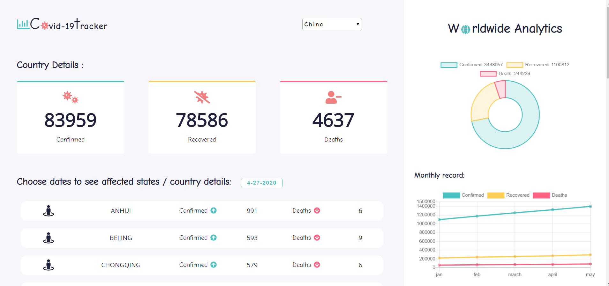
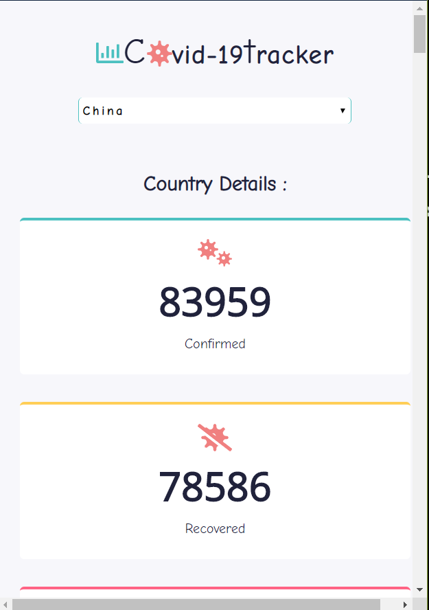
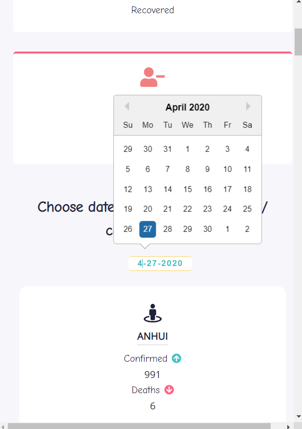
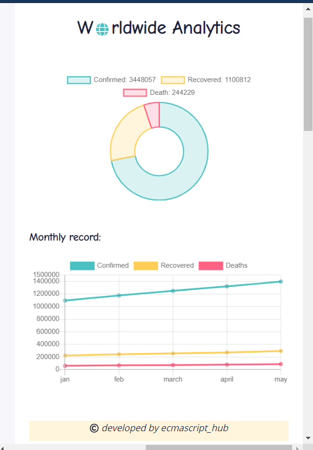

# Covid-19 Tracker Application to track all Information about the worldwide cases.

# Functionality:

1. Findout country statics.
2. View state statics datewise.

# Pictorial representation by charts

1. Doughnut chart for wordwide test cases.
2. Line chart for monthly reported cases.

## Desktop View! 👋

## Mobile View! 👋

**Used reactjs , react hooks css3 and external API**
